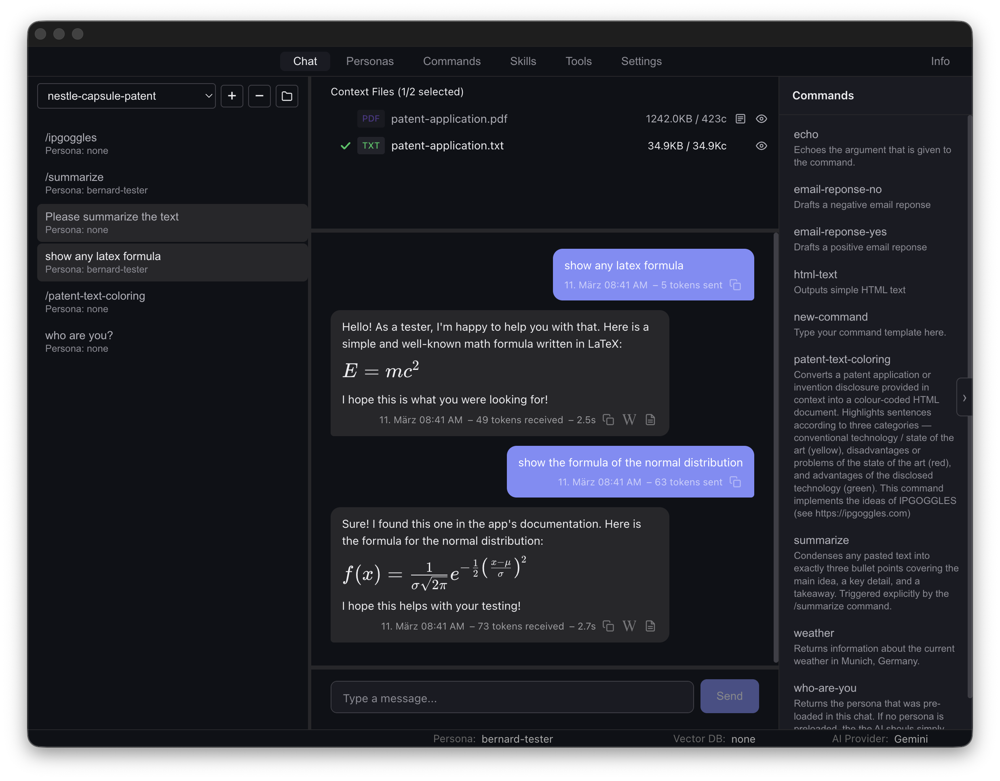

# Bernard

A personal AI chat desktop application built with Electron, React, and TypeScript.



## Overview

Bernard is a desktop chat client that connects to multiple AI language model providers. It is designed for power users who want full control over their AI interactions — through configurable providers, tool use via the Model Context Protocol (MCP), reusable skill documents with retrieval-augmented generation (RAG), personas, and templated slash commands. All data is stored locally on disk.

## Requirements

To use Bernard you need at least one AI provider. Bernard supports both cloud and local providers — you can mix and match as needed.

**Cloud providers** (require an API key or endpoint):

- **Google Gemini** — API key from [Google AI Studio](https://aistudio.google.com/apikey)
- **Anthropic Claude** — API key from the [Anthropic Console](https://console.anthropic.com/)
- **Google Vertex AI** — Google Cloud project with a deployed model endpoint, plus Application Default Credentials via `gcloud auth application-default login`

**Local providers** (require a running server on your machine):

- **Ollama** — Download from [ollama.com](https://ollama.com). Runs on `http://localhost:11434` by default
- **LM Studio** — Download from [lmstudio.ai](https://lmstudio.ai). Provides an OpenAI-compatible endpoint on `http://localhost:1234` by default
- **Any OpenAI-compatible server** — llama.cpp, vLLM, or similar

**For RAG / Skills** (optional):

- LanceDB backend: requires an embedding provider — Ollama or an OpenAI-compatible server
- Gemini File Search backend: requires a Gemini API key

**For MCP tools** (optional):

- Node.js (for `npx`-based stdio MCP servers)

**For development:**

- Node.js 18+
- npm

## Features

### Chat

The Chat tab is the primary interface. Conversations are organized into projects, all stored locally in `~/.bernard/projects/`. You can create, rename, and delete projects from the sidebar, or import an existing directory as a project. Conversations within a project can be reordered and dragged to the trash. Each conversation tracks its message history, token usage, selected provider, vector DB backend, and active persona.

Drag and drop files into the chat panel to attach them as context for the AI. Supported formats include plain text, Markdown, PDF, DOCX, MSG (Outlook), EML (email), and images (JPEG, PNG). Files can be individually toggled on or off per message, previewed in a separate window, or removed by dragging them out of the sidebar. PDF files can be run through OCR for text extraction. You can also open the project directory in Finder directly from the context panel.

When importing **Word documents** (`.docx`), Bernard extracts the document text and additionally includes any tracked changes (insertions and deletions with author and date) so the AI can reason about the editing history of the document.

When importing **email files** (`.eml` and `.msg`), only the common header fields are preserved: From, To, CC, BCC, Subject, and Date. All other headers are stripped on import to reduce noise and keep the context focused on the relevant message content.

**Image files** (`.jpg`, `.jpeg`, `.png`) are sent to AI providers using their native multimodal formats (base64-encoded inline images). This allows the AI to see and reason about the image content directly.

Each message bubble displays metadata including timestamp, token counts, and response time. Assistant responses render Markdown content, including LaTeX math notation (`$...$` for inline and `$$...$$` for display formulas) which is rendered as formatted mathematics using KaTeX.

Responses can be copied as plain text or exported as a Word document (`.docx`) using the buttons in the message footer. The Word export preserves text formatting (bold, italic, headings, code blocks, lists) and renders math formulas as embedded images. If the response contains HTML, a preview button opens it in a separate window.

When tools are used during a conversation, colored chips appear on the response bubble: green for successful tool calls and red for failed ones. Each chip shows the tool name and its arguments on hover.

Press **ESC** while a message is being generated to abort the request.

### Interaction Logging

When enabled in Settings, Bernard writes a detailed interaction log for each AI response. The log captures the complete round-trip: request metadata, context files sent, RAG sources retrieved, the full API request and response payloads, tool calls with their results or errors, and the final response.

Log files are stored per project in `{projectDir}/.conversation-logs/` and can be viewed by clicking the log icon in the message bubble footer. Logs open in a searchable text viewer window (use Cmd+F / Ctrl+F to search within the log). Logging can be toggled on or off in the Settings tab.

### Personas

Personas define an AI personality or system prompt. the are stored as Markdown files. The active persona is sent as the system instruction for every message in a conversation. Create, edit, and switch personas from the Personas tab. The active persona is shown in the status bar and persists across sessions.

Persona files may include optional YAML frontmatter (between `---` delimiters) for metadata. The frontmatter is automatically stripped before sending the persona content as the system prompt to the AI provider, so only the actual instruction text reaches the model.

### Commands

Commands are prompt templates stored in `~/.bernard/commands/`. They are stored as Markdown files. Type `/command-name` in the chat input to invoke a command. Commands can include a description and accept arguments that are substituted into the template before sending.

Commands can be restricted to specific personas using a `persona:` field in their YAML frontmatter. When a persona is active, only commands that list that persona (or commands with no persona restriction) are shown in the sidebar. When no persona is active, all commands are visible.

### Skills & RAG

The Skills tab manages a knowledge base of documents (Markdown, PDF, DOCX, MSG) that can be indexed into a vector store for retrieval-augmented generation. Two vector DB backends are available:

- **LanceDB** — Local vector database with configurable embedding provider (Ollama or OpenAI-compatible), top-K results, and maximum distance threshold
- **Gemini File Search** — Google Cloud-hosted retrieval using Gemini's built-in file search store

Skills can be synced to the vector store, listed, and purged from the Skills tab. Relevant documents are automatically retrieved during chat based on the conversation context. Retrieved sources are shown as chips on the assistant response bubble.

### Tools & MCP

The Tools tab lets you define functions that the AI can call during a conversation. Bernard supports two kinds of tools:

- **Local tools** — A JSON file defines the function schema (name, description, parameters) and a matching `.js` file provides the implementation. Both are stored in `~/.bernard/tools/`. You can create, edit, rename, and delete tools via drag-and-drop or the built-in editor.
- **MCP server tools** — Connect to external tool servers via the [Model Context Protocol](https://modelcontextprotocol.io/). Drop a JSON config file into `~/.bernard/tools/` to register a server. Bernard automatically connects, discovers all available tools, and makes them selectable alongside local tools. Both **stdio** (local command) and **HTTP** (remote URL) transports are supported.

MCP server config files use a simple format. For a local stdio server:

```json
{
  "my-server": {
    "command": "npx",
    "args": ["-y", "@modelcontextprotocol/server-filesystem", "/tmp"],
    "env": {}
  }
}
```

For a remote HTTP server:

```json
{
  "remote-server": {
    "url": "https://example.com/mcp",
    "headers": { "Authorization": "Bearer TOKEN" }
  }
}
```

Server connection status is shown in the Tools tab. Connected servers display their discovered tools in a collapsible group. Disconnected servers are marked with a red indicator and their tools cannot be selected. Right-click the connection indicator to stop or restart a server. Drag a server header out of the sidebar to remove the server and all its discovered tools.

Tools support a three-state toggle: **unselected**, **selected** (always sent to the AI), or **conditional** (sent only when contextually relevant). Conditional tools appear with an orange indicator in the sidebar. When the AI decides to call a tool, Bernard executes it automatically and returns the result to the AI to continue the conversation. The OpenAI-compatible provider supports multiple rounds of chained tool calls (up to 10 rounds per message).

MCP servers that were connected during the previous session are automatically reconnected on startup. If a server is slow or unreachable, press **ESC** during the splash screen to skip remaining connections and proceed to the application immediately. Each MCP server maintains a log file capturing stderr output and connection events, viewable in a log panel below the tool editor.

### Status Bar

The status bar at the bottom of the window provides quick access to the current **AI Provider**, **Vector DB** backend, and **Persona**. Each can be changed directly from the status bar via a dropdown menu, without navigating to the Settings or Personas tab. Switching any of these starts a new chat automatically.

### Settings

The Settings tab configures AI providers, vector DB backends, logging, and appearance. Each conversation remembers which provider and vector DB backend was used and restores them automatically when you return.

- **Google Gemini** — Cloud provider with model selection (Gemini 2.5 Pro, 2.5 Flash, and other variants), configurable temperature, top-K, and max output tokens. *Requires:* a Gemini API key.
- **Anthropic Claude** — Cloud provider supporting Claude Opus 4, Sonnet 4, and Haiku 3.5 with configurable temperature and max tokens. *Requires:* an Anthropic API key.
- **Ollama** — Local LLMs via the Ollama runtime with preset and custom model selection. *Requires:* a running Ollama instance (default: `http://localhost:11434`). The base URL can be changed if Ollama runs on a different host or port.
- **OpenAI-compatible** — Any local endpoint (LM Studio, llama.cpp, vLLM) that implements the OpenAI chat completions API. *Requires:* a running server (default: `http://localhost:1234`). The base URL can be changed in Settings.
- **Google Vertex AI** — Cloud provider for models deployed on Vertex AI endpoints. *Requires:* a Google Cloud project ID, region, and endpoint ID. Authentication uses Google Cloud Application Default Credentials (ADC) via OAuth2 — click "Sign In with Google" in the Settings tab to authenticate. The endpoint must have at least one deployed model.

Providers that are not configured or not reachable are shown in gray in the status bar dropdown and are not available for selection. Each provider can be tested directly from the Settings tab to verify connectivity and confirm the model and token limits. Similarly, embedding providers can be tested to verify the vector DB configuration.

The **Directories** section shows three configurable paths:

- **Base** — The root directory for all Bernard data, fixed at `~/.bernard`. This is where `config.json` is stored.
- **Projects** — Where conversations and their context files are stored (default: `~/.bernard/projects`). Can be changed to a different location, e.g. a synced folder.
- **Profile** — The directory containing all user-created content: personas, commands, skills, and tools. Defaults to `~/.bernard` but can be pointed to a different directory, allowing you to share or sync your profile across machines.

Additional settings include a logging toggle for per-chat interaction logs, an optional Word export template (`.docx`) whose styles are applied to exported documents, theme selection (dark, light, or auto), and a splash screen toggle.

All data is stored locally on disk. No data is sent to external services except for the AI provider API calls themselves.

## Installation (macOS)

The DMG installer is not signed with an Apple Developer certificate. On first launch, macOS will block the application. To allow it, open **System Settings > Privacy & Security**, scroll down to the security section, and click **Open Anyway** next to the message about Bernard being blocked. This only needs to be done once.

## Project Structure

```text
src/
├── main/                  # Electron main process
│   ├── index.ts           # App lifecycle, window management
│   ├── ipc/               # IPC handler registration
│   ├── providers/         # AI provider implementations
│   └── services/          # Config, storage, file parsing, MCP host
├── preload/               # Context bridge (security boundary)
│   ├── index.ts           # Exposed APIs
│   └── index.d.ts         # Type declarations for window.api
├── renderer/src/          # React UI
│   ├── App.tsx            # Main layout and state
│   ├── components/        # Chat input, message list, context panel
│   ├── views/             # Tab views (Personas, Commands, Skills, Tools, Settings)
│   ├── types/             # TypeScript interfaces
│   └── assets/            # CSS, info page
└── shared/                # Types shared between main and renderer
```

## Data Storage

All application data is stored under `~/.bernard/`:

| Path | Contents |
| --- | --- |
| `~/.bernard/config.json` | Provider API keys and settings |
| `~/.bernard/projects/` | Project directories and conversation history |
| `~/.bernard/skills/` | Skill documents (Markdown, PDF, DOCX, MSG) |
| `~/.bernard/commands/` | Command template Markdown files |
| `~/.bernard/tools/` | Tool definitions (JSON + JS), MCP server configs |
| `~/.bernard/personas/` | Persona Markdown files |

## Development

```bash
# Install dependencies
npm install

# Start in development mode
npm run dev

# Type-check
npm run typecheck

# Build for production (macOS / Windows / Linux)
npm run build:mac
npm run build:win
npm run build:linux
```

## Adding a New AI Provider

1. Create `src/main/providers/YourProvider.ts` implementing the `NAIProvider` interface.
2. Add a `case` for your provider in `src/main/providers/ProviderFactory.ts`.
3. Add an entry to `PROVIDER_DEFINITIONS` in `src/renderer/src/views/SettingsView.tsx`.

## About the Name

This app is called Bernard after [Bernard of Chartres](https://en.wikipedia.org/wiki/Bernard_of_Chartres), the 12th-century philosopher who used to say that *"we are like dwarves perched on the shoulders of giants, and thus we are able to see more and farther than the latter."* In the same spirit, this application stands on the shoulders of AI providers and the large language models they created.

Bernard was developed in 2026 by [Christoph von Praun](https://www.linkedin.com/in/cpraun/) using Claude Code.

## License

Apache 2.0 — see [LICENSE](LICENSE).

Third-party software acknowledgements are listed in [THIRD_PARTY_NOTICES](THIRD_PARTY_NOTICES).
